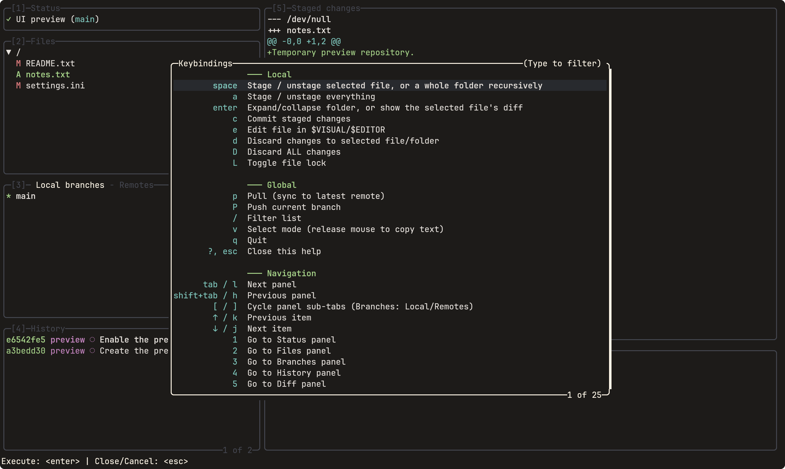

# lazylore

A terminal UI for [Lore](https://github.com/EpicGames/lore), Epic Games' open source version control system, inspired by [lazygit](https://github.com/jesseduffield/lazygit).



## Requirements

- A Lore installation discoverable automatically or configured through
  `lorePath` in `config.yaml`, see below.
- Go 1.24.2 or newer when installing with Go or building from source.

## Installation

On Windows, once the package is available in WinGet:

```powershell
winget install --exact --id Solessfir.lazylore
```

On Linux, install the latest release with:

```bash
curl -fsSL https://raw.githubusercontent.com/Solessfir/lazylore/main/install.sh | sh
```

To choose another directory, run the downloaded script as `sh install.sh /your/bin`.

Or install with Go:

```bash
go install github.com/solessfir/lazylore/cmd/lazylore@latest
```

Go places the executable in `GOBIN`, or `GOPATH/bin` when `GOBIN` is unset.
Add that directory to your `PATH`.

Download the archive for your OS and architecture from the
[Releases page](https://github.com/Solessfir/lazylore/releases), extract
`lazylore` (`lazylore.exe` on Windows), and place it on your `PATH`.

Or build from source:

```bash
git clone https://github.com/Solessfir/lazylore.git
cd lazylore
go build -o bin/lazylore ./cmd/lazylore
```

Run the executable from a Lore working repository, using its full path if
it is not on your `PATH`. When launched outside one, it prompts for a remote
URL and clones into the current directory.

## Configuration

Optional. `lazylore` auto-detects the `lore` binary: first on `PATH`, then
the platform's default install location (`C:\Program Files\lore\lore.exe`
on Windows; `/usr/local/bin/lore`, then `/opt/lore/bin/lore`, on Linux and
macOS). Most installs need no configuration at all.

If `lore` lives somewhere else, set `lorePath` in `config.yaml`:

| Platform | Path |
|---|---|
| Linux | `~/.config/lazylore/config.yaml` |
| macOS | `~/Library/Application Support/lazylore/config.yaml` |
| Windows | `%AppData%\lazylore\config.yaml` |

```yaml
lorePath: C:\custom\path\to\lore.exe
```

Relative binary paths resolve from the directory where `lazylore` is launched.
On Linux, `$XDG_CONFIG_HOME/lazylore` overrides the default config directory.
Existing `config.yml` files remain supported when `config.yaml` is absent.

Lore handles repository and server configuration. For servers requiring
authentication, sign in with the Lore CLI before launching; `lazylore` uses
the existing Lore credentials and environment.

File editing uses `$VISUAL`, then `$EDITOR`. With neither set, Windows uses
Notepad; Linux and macOS use the first installed editor from `vi`, `vim`,
`nvim`, and `nano`. Editor commands may include quoted arguments.

## Keybindings

Press `?` for context-sensitive help. Type to search descriptions, or start with `@` to search keys. Arrow keys select a binding and `Enter` executes it. `Esc` clears the search first, then closes help.

### Global

| Key | Action |
|---|---|
| `Tab` / `Shift+Tab` or `l` / `h` | Cycle focused pane |
| `1`-`6` | Jump to Status, Files, Branches, History, Diff, or Command Log |
| `[` / `]` | Cycle Branches sub-tab (Local / Remotes) |
| `p` / `P` | Pull / push the current branch |
| `/` | Filter the focused list |
| `v` | Select mode (release mouse capture to copy text; any key restores capture) |
| Mouse click | Focus a pane / select a row |
| Mouse wheel | Scroll the list or diff under the cursor |
| `?` | Keybindings help |
| `q` / `Ctrl+C` | Quit |

Press `Enter` to apply a list filter and `Esc` to clear it. In confirmation dialogs, `Enter` or `y` confirms; `Esc` or `n` cancels.

### Files pane

| Key | Action |
|---|---|
| `↑↓` / `j` / `k` | Move selection |
| `Space` | Stage / unstage the selected file, or a whole folder recursively |
| `a` | Stage / unstage everything |
| `Enter` | Expand/collapse a folder, or view the selected file's diff |
| `c` | Commit staged changes; if none are staged, confirm staging all changes first |
| `e` | Edit the file in `$VISUAL`/`$EDITOR` |
| `d` | Discard menu (`x` discard all, `u` discard unstaged - folders with a mix of staged/unstaged files only) |
| `D` | Confirm discarding changes in the files listed when the prompt opens |
| `L` | Lock / unlock a file; another owner's lock requires force-unlock confirmation |

Use arrow keys or `j` / `k` in the discard menu, `Enter` / `Space` to execute, and `Esc` to cancel. The `x` and `u` shortcuts execute their options directly.

Folder discard affects the files listed when confirmation opens. Discarding unstaged changes preserves files staged afterward.

### Branches pane

| Key | Action |
|---|---|
| `Space` | Checkout the selected branch |
| `n` | Create a new branch |
| `g` | Reset the current branch to the selected branch |
| `M` | Merge the selected branch into the current branch |

Reset (`g`) changes the branch's latest revision without changing working files.

### History pane

| Key | Action |
|---|---|
| `Space` | Checkout the selected revision |
| `d` | Revert the selected revision by creating a new revision |
| `g` | Reset the current branch to the selected revision |

Clean merges and reverts commit automatically. Use the Lore CLI to resolve
or abort conflicts; the TUI reports them as errors.

## Development

```bash
go test ./...
go vet ./...
```

To exercise the real CLI and a disposable local server, set absolute paths
to matching Epic Lore binaries:

```bash
LORE_TEST_BINARY=/path/to/lore LORE_TEST_SERVER=/path/to/loreserver go test ./internal/lore -run TestNativeWorkflow -v
```

The native test creates its own repository, server storage, and configuration,
and removes them afterward. It is skipped when the binary paths are unset.

## License

Licensed under the [MIT License](LICENSE).
